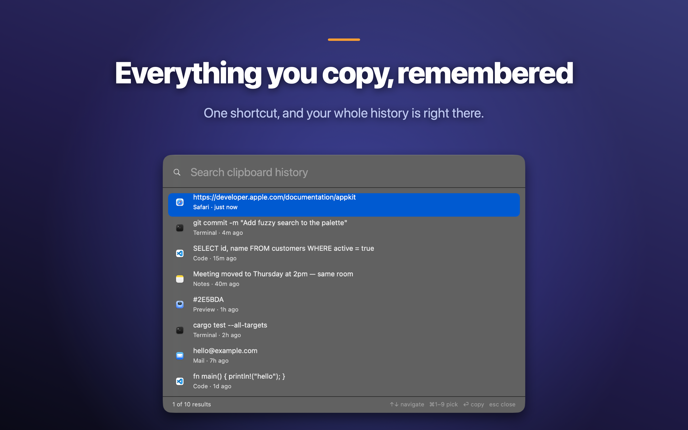
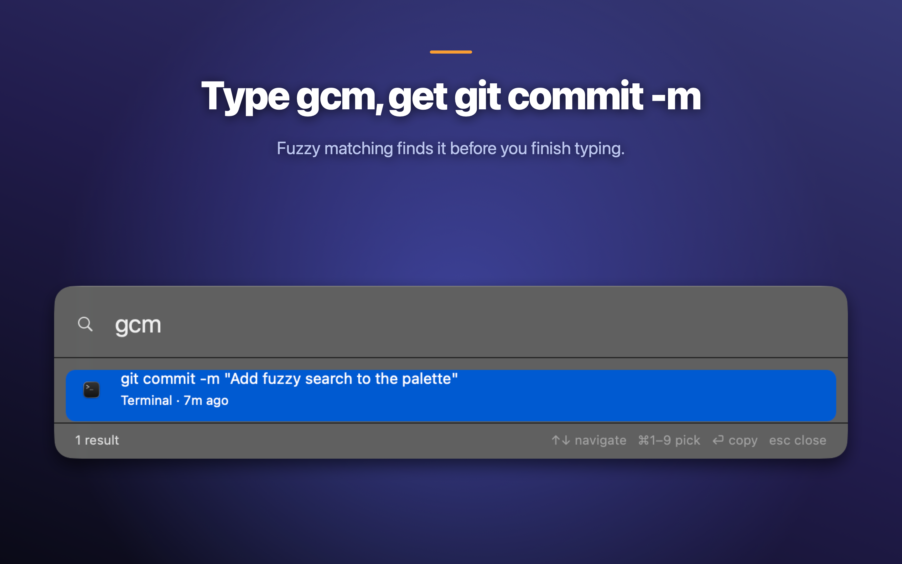
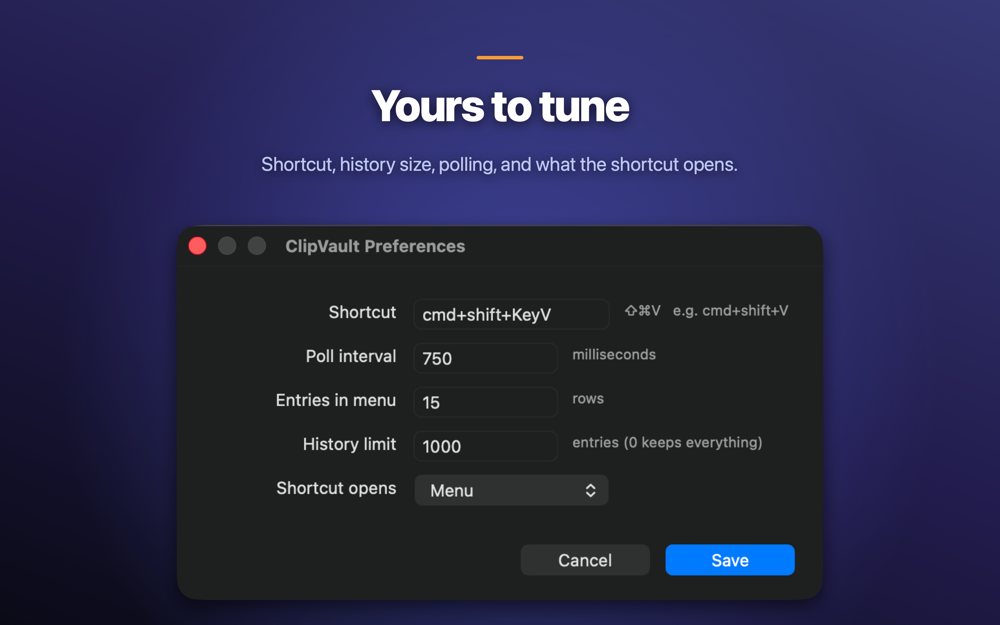

# ClipVault

A clipboard history keeper for macOS. It lives in the menu bar, remembers what
you copy, and gives it back to you with ⇧⌘V.



Everything stays on your machine. There is no account, no sync, and no network
code anywhere in the project — see [PRIVACY.md](PRIVACY.md).

## Install

Download `ClipVault.zip` from the [latest release][releases], unzip it, and drag
`ClipVault.app` into `/Applications`.

The first launch needs one extra step, because the app isn't signed with a paid
Apple Developer certificate: **right-click the app → Open**, then confirm. macOS
remembers the choice, so this is only once. If Gatekeeper refuses outright:

```sh
xattr -dr com.apple.quarantine /Applications/ClipVault.app
```

ClipVault is menu bar only — no Dock icon and no window on launch. If nothing
seems to happen, look for the clipboard icon in the menu bar.

Requires macOS 11 or later. Universal binary (Apple Silicon and Intel).

[releases]: https://github.com/SeifBoukerdenna/clipvault/releases/latest

## Using it

Press **⇧⌘V** for your history. By default that opens the menu; in Preferences
you can make it open the search palette instead.

| Menu | |
|---|---|
| ⌘1 – ⌘9 | copy one of the first nine entries |
| Search History… | open the fuzzy search palette |
| Pin Current Clipboard | keep a snippet at the top, never pruned |
| Delete Current Entry | ⌘⌫ |
| Clear History | ⇧⌘⌫ |

In the search palette, type to filter, **↑/↓** to move, **↩** to copy, **⎋** to
close. Matching is fuzzy — `hlo` finds `hello world`, and `gcm` finds
`git commit -m`.



Passwords are skipped. macOS lets apps mark pasteboard content as concealed, and
password managers do; ClipVault never records anything flagged that way, and
fails closed if it can't read the flags at all.

## Preferences



| Setting | Default | |
|---|---|---|
| Global shortcut | ⇧⌘V | press the keys, don't type the name |
| Poll interval | 750 ms | how often the clipboard is checked |
| Menu entries | 15 | rows in the menu |
| History limit | 1000 | 0 keeps everything |
| Shortcut opens | Menu | Menu or Search |

Settings live in `~/.clipvault/config.json` and can be edited by hand. Values
that would make the app unusable — a 1 ms poll, zero menu rows — are clamped on
load rather than rejected.

## Command line

The app bundle ships a `clipvault` CLI alongside it, reading the same history:

```sh
clipvault watch            # poll the clipboard and record changes (default)
clipvault list -n 20       # show the last 20 entries
clipvault search ssh       # fuzzy search across history
clipvault copy 42          # put entry 42 back on the clipboard
```

Indices are absolute positions in the history file, so they stay valid as new
entries arrive and can be passed straight to `copy`.

Only one watcher can run at a time. The CLI and the menu bar app take the same
lock, so starting `clipvault watch` while the app is open tells you so instead
of recording every copy twice.

History is append-only JSON Lines at `~/.clipvault/history.jsonl`, owner-only
(`0600`).

## Build from source

Needs a Rust toolchain (2024 edition).

```sh
cargo test                        # 76 tests
./scripts/bundle.sh --install     # build ClipVault.app into dist/, copy to /Applications
```

`bundle.sh` builds for the host architecture and ad-hoc signs, which is all a
local install needs. For something distributable:

```sh
./scripts/release.sh                       # universal, best available signature, zipped
./scripts/release.sh --notarize <profile>  # …then notarize and staple
```

`release.sh` picks up a Developer ID Application certificate if one is in the
keychain and falls back to an ad-hoc signature if not. Notarizing needs the
certificate, which needs a paid Apple Developer membership — an "Apple
Development" certificate won't work.

## Layout

| | |
|---|---|
| `src/history.rs` | append-only storage, pruning, permissions |
| `src/menubar/mod.rs` | the status item, the menu, the app's state and timer |
| `src/menubar/palette.rs` | the search palette |
| `src/menubar/prefs.rs` | the preferences window |
| `src/menubar/icons.rs` | menu bar glyph and per-row app icons |
| `src/fuzzy.rs` | subsequence scoring |
| `src/watch.rs` | the polling loop |
| `src/poll.rs` | clipboard reads and writes, concealed-content checks |
| `src/pins.rs` | pinned snippets |
| `src/config.rs` | settings |
| `scripts/` | bundling, signing, icon generation |

## License

MIT — see [LICENSE](LICENSE).
